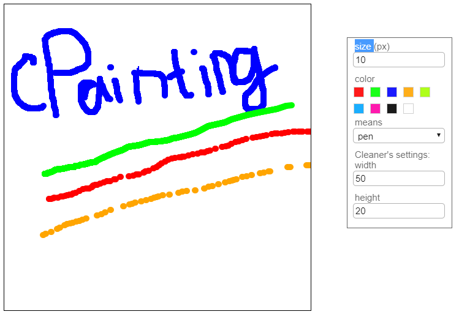
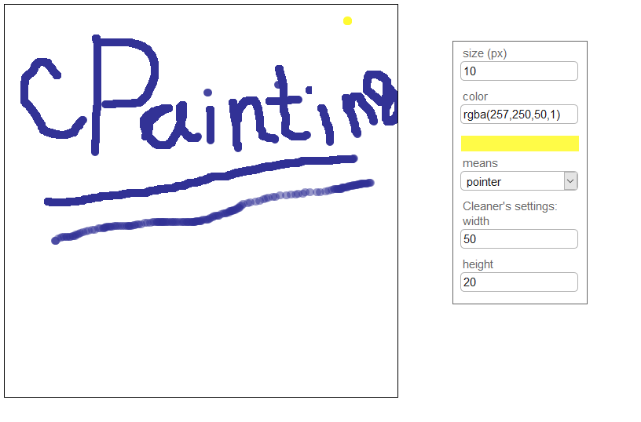

# canvas-painting
  cPainting is a special module created on your web site for drawing canvas. This module is supported by all PC browsers that support work with <i><canvas></i>.

<h3>How to connect?</h3> 
To connect, you need to connect it to the <i><script></i> tag, create an element <i>&lt;div id ="CanvasDrawerADIO"&gt; &lt;/div&gt;</i> on the page and call the <i>startCreateDesigner()</i> function (see <i>index.html</i>).
Note that this function is called by default after the module is loaded. All the settings that are implemented at the moment, you can find at the beginning of the module - object _settings_. 
Attention: the global <i>settings</i> object and the global function <i>startCreateDesigner()</i> are created for module operation. And also the CSS classes: AIDO_inputs and AIDO_labels.  
id:<ul>
 <li>AIDO_inp_means</li>
 <li>AIDO_inp_color</li>
 <li>AIDO_inp_size</li>
 <li>inp_sett_cleaner_width</li>
 <li>inp_sett_cleaner_height</li>
 <li>ADIO_Menu</li>
 </ul>
There are three states for the menu: none (hidden), less (only standard colors) and pro (any colors)

The _CanvasDrawerADIO_ element can be found anywhere on the page, no styles are required for it. 

If you have any questions or suggestions, please contact ivan-753s@mail.ru .
